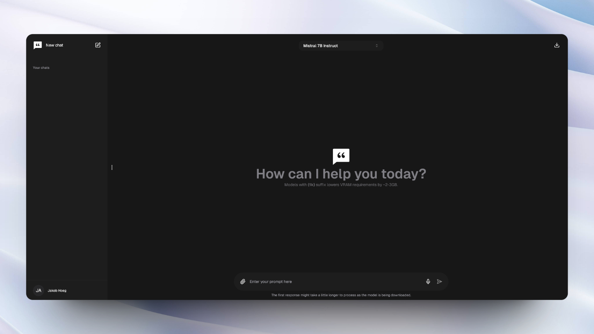

<div align="center">
  
  [](https://chattyui.com/)
  
</div>

<h1 align="center">
  Chatty
</h1>

<div align="center">
  
   


# Preview

https://github.com/addyosmani/chatty/assets/114422072/a994cc5c-a99d-4fd2-9eab-c2d4267fcfd3

# How to Install

> If you just want to try out the app, it's live on [this](https://chattyui.com) website.
>
> This is a Next.js application and requires Node.js (18+) and npm installed to run the project locally.

## Install from source

If you want to setup and run the project locally, follow the steps below:

**1. Clone the repository to a directory on your pc via command prompt:**

```
git clone https://github.com/addyosmani/chatty
```

**2. Open the folder:**

```
cd chatty
```

**3. Install dependencies:**

```
npm install
```

**4. Start the development server:**

```
npm run dev
```

**5. Go to [localhost:3000](http://localhost:3000) and start chatting!**

## Docker

> [!NOTE]  
> The Dockerfile has not yet been optimized for a production environment. If you wish to do so yourself, checkout the [Nextjs example](https://github.com/vercel/next.js/blob/canary/examples/with-docker/Dockerfile)

```
docker build -t chattyui .
docker run -d -p 3000:3000 chattyui
```

Or use `docker-compose`:

```
docker compose up
```
